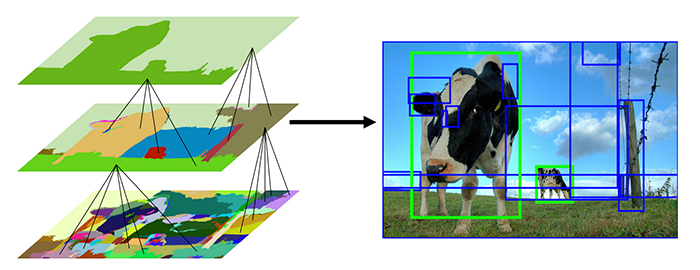

# Selective-Search-for-Object-Detection

Selective search được sử dụng dựa trên image segmetation để đưa ra các region proposals (khoảng 2000 regions) có khả năng chứa object. Selective search có performance tốt hơn nhiều so với sử dụng image pyramid và sliding window.
Việc nghiên cứu Selective earch cũng giúp các nhà khoa học tạo ra một công cụ mạnh mẽ hơn sau này là Region Proposal Network. Trong bài này chúng ta sẽ đi thực hiện selective search để lấy ra các region proposals.

Selective search phân đoạn ảnh, chọn ra các region proposals dựa trên một số đặc điểm như:
- Color similarity
- Textuture similarity
- Size similarity
- Shape similarity
- Meta-similarity (kết hợp tuyến tính của những cái trên)

Trong bài trước nhận thấy việc khả năng ứng dụng image pyramid và sliding window phụ thuộc rất nhiều vào các thông số. Việc lựa chọn các thông số không tốt có thể dẫn tới kết quả không như mong muốn.

Selective search hoạt động bằng cách sử dụng [superpixel algorithm](https://www.pyimagesearch.com/tag/superpixel/). Ví dụ sử dụng superpixel algorithm được biểu diễn trong hình sau:

Selective search tìm cách hợp nhất các superpixels để tìm ra các vùng có khả năng chứa vật thể.

